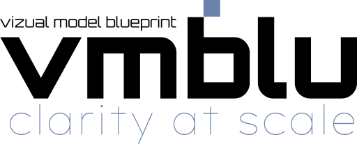
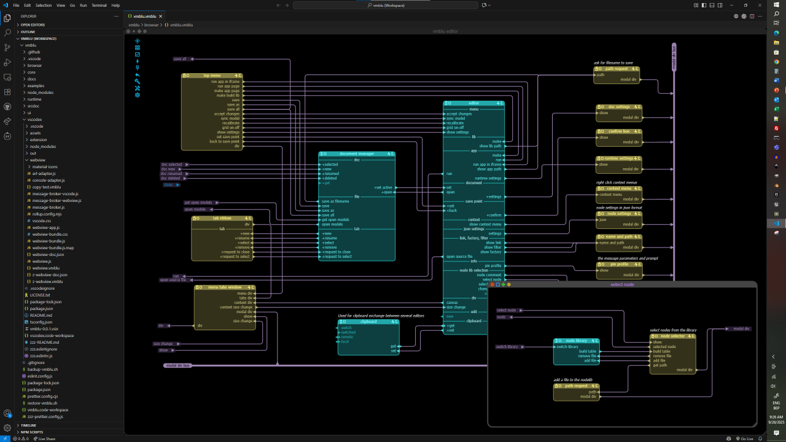

**vmblu** is a tool that makes the architecture of your software explicit and easy to navigate — by humans *and* LLMs. 

Modern LLMs make it easy to “vibe code” — write fast with AI. But as your app grows, features break, code bloat creeps in and the big picture fades.

**vmblu** fixes that by making your *architecture* **structured, visual, and AI-native**.

With **vmblu**, you can co-write your project with an LLM while keeping the architecture clear, the codebase maintainable, and the system navigable.

---
<b>■   What is vmblu?</b> 

**vmblu** is a graphical editor and file format for building software as a **network of message-passing nodes**.

It’s:
- **AI-native** — LLMs can design the architecture, write the code and interact with the running system.
- A **visual modeler** that makes your architecture explicit and navigable  
- A **runnable scaffold** — models execute via the vmblu runtime  
- **Framework-agnostic** — use any stack or package, from JS/TS to Svelte or Three.js  

The **vmblu model** is not documentation, it is the actual system.

---
<b>■ The Editor</b> 

The **vmblu editor** lets you:
- Create and connect nodes visually  
- Define message I/O via **pins**  
- Group subsystems into **group nodes**  
- Reuse components via **linked nodes** or **standard libraries**  
- Jump from a node to its source code instantly  

Clean connectivity by using
- **Busbars** — broadcast to all connected nodes  
- **Cables** — selective point-to-point  
- **Filters** — dynamic dispatch

The following is a screenshot from an application in vmblu:

---
<b>■ AI-native by design</b> 

**vmblu** was designed to let LLMs do the work, but to keep the human in the driver seat.

- **vmblu** was built for LLM integration from the start: the model format is LLM-friendly, so you and the AI can reason about and modify architecture together.
- The **vmblu model** with explicit and clear contracts between the building blocks, is a great help for an LLM to write the code for the nodes of the application.
- **vmblu** can generate an [MCP](https://github.com/modelcontext) tools file to call into a running system allowing to have an instant AI-based user interface at a granular level for your application.

---
<b>■ AI generated code poses new challenges</b> 

When code is written or co-written by LLMs, the nature of risk changes. LLMs make far fewer syntax errors or trivial logic mistakes than human developers.  
The bigger challenges are:

- **Trustworthiness**: LLMs can hallucinate extra behavior, misinterpret user intent, or—if a bad actor is involved—introduce malicious side-effects. We need assurance that nodes and systems do *only* what they are supposed to do.  
- **Efficiency**: LLMs may generate redundant or roundabout logic. Even if outputs are correct, wasted messages, loops, or hidden work can compromise performance and scalability.

**vmblu** gives you the tool you need to address these new challenges. Working from an explicit, shared architecture allows you to understand and test your system in the age of AI.

---
<b>■ For developers</b> 

**vmblu** is a tool targeted at developers whose role is changing with the arrival of powerful AI.

**vmblu** is for developers building real, complex systems. It is an excellent foundation to build agentic systems. It gives you:

- Clear, maintainable architectural design  
- Modular components and reuse  
- Always-up-to-date documentation  (the model *is* the doc)
- Live reconfiguration and testing  
- AI collaboration through structure-aware tools  

Migrating an application to a **vmblu** based design is also not complicated. The vmblu editor itself is now a vmblu application.

**vmblu** is currently at version 0.9, with version 1.0 planned before the end of the year (2025). Specification and file formats are in good shape, but expect frequent updates now that there are more eyes and hands interacting with the software.

---
<b>■ Quick start</b> 

- Install the [VS Code extension](https://marketplace.visualstudio.com/)  
- Add the runtime with: `npm install @vizualmodel/vmblu`  
- Read more at 🌐 [vmblu.dev](https://vmblu.dev)  
- Contribute on 🔗 [GitHub](https://github.com/vizualmodel/vmblu)

---
<b>■ Open source</b> 

**vmblu** is licensed under the [Apache License 2.0](./LICENSE.txt).

---

  <b>vmblu</b> 
  clarity at scale

