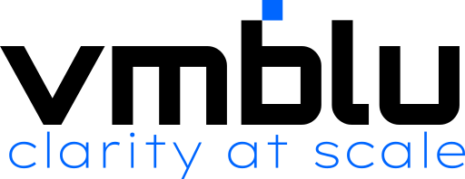
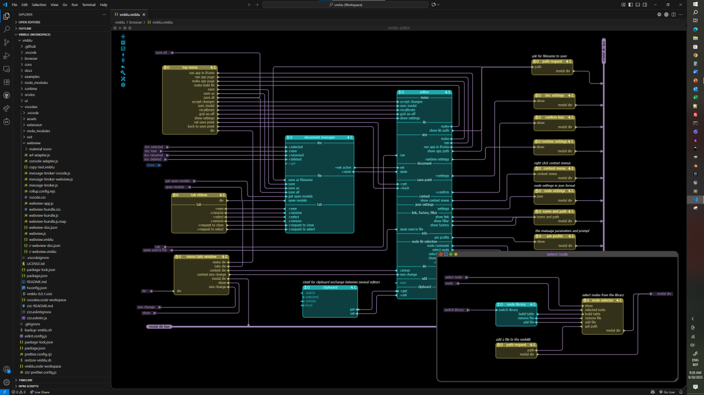

Modern LLMs make it easy to “vibe code.” But as an application grows, features break, code bloat creeps in, and the big picture fades. It becomes difficult to understand exactly what is happening in a non-trivial system.

**vmblu** makes software architecture structured, visual, executable, and AI-native. With vmblu, developers and coding agents can design and build a project together while keeping its architecture clear, its codebase maintainable, and its behavior navigable.

## What is vmblu?

**vmblu** is an open-source framework and toolchain for building trusted, maintainable software with coding agents. It combines a graphical architecture editor, formal schemas, agent context, source-analysis tools, code generation, and message-based runtimes.

vmblu is:

- **AI-native** — humans and coding agents can reason about and modify the same explicit architecture.
- A **visual modeler** — nodes, interfaces, contracts, and message routes make the system structure navigable.
- An **executable blueprint** — the architecture drives source analysis, generation, testing, runtime behavior, and agent interaction.
- **Agent-ready** — applications can expose selected tools, probes, and events through a controlled capability surface.
- **Runtime-controlled** — runtime selection and policy determine how messages, monitoring, security, and agent access are handled.
- **Framework-agnostic** — use the languages, frameworks, libraries, and packages that fit the application.

The vmblu blueprint is not a diagram maintained separately from the implementation. It is the architectural source of truth for the system.



## Architecture first

A vmblu application is modeled as nodes that communicate through named pins and message routes. Pin contracts describe the data crossing those boundaries. Complex nodes can contain groups of nodes, while linked nodes make it possible to reuse architecture across models.

This structure gives both humans and coding agents a compact system-level view:

- Functionality is localized in nodes.
- Communication paths are explicit.
- Message contracts define component boundaries.
- Source code remains connected to the architecture that owns it.
- Large applications can be understood and changed one subsystem at a time.

The graphical editor lets developers navigate and modify the blueprint, inspect nodes and contracts, follow message routes, open source implementations, and review runtime and agent settings.

## AI-native by design

vmblu is designed for software development in which coding agents do a substantial part of the implementation work while developers remain responsible for architecture, intent, safety, and reliability.

The blueprint gives an agent precise context before it writes code. Instead of inferring the whole system from a large and changing codebase, the agent can first agree on the node structure, interfaces, data contracts, and routes. It can then work within a clear node or subsystem boundary without needing the entire repository in context.

vmblu also supplies versioned schemas, framework instructions, project-local prompts, and CLI commands. Together they give coding agents a repeatable workflow: understand the architecture, implement node-owned code, generate derived artifacts, verify consistency, and report what was tested.

## Controlled and observable runtimes

vmblu models communication explicitly and routes messages between nodes through a selectable runtime. Different runtimes can provide different execution, monitoring, security, and agent-integration behavior, and applications can select or implement the runtime profile that matches their requirements.

The safety-enabled Node.js runtime can attribute selected filesystem, network, and process operations to the responsible node. Model-level policy defines the security envelope, while node-level settings can request the access a node needs without broadening that envelope. Depending on the configured policy, operations can be allowed, reported, or denied. Denied intercepted operations are blocked and emitted as structured security events.

Because the runtime is replaceable and extensible, projects can choose lightweight observation or stricter enforcement. A strict security profile can constrain node access to approved filesystem roots, network hosts, and process commands, and future runtimes can extend both the enforcement coverage and the isolation model.

## Agent capabilities

A vmblu application can expose an intentional capability surface to external agents. Capabilities are declared in the blueprint and generated into a `<model-name>.cap.json` manifest containing:

- **Tools** — actions an agent may request.
- **Probes** — read-only application state an agent may inspect.
- **Events** — application behavior an agent may observe.
- **Policy metadata** — permissions, risk, approval, effects, and verification guidance.

Agents do not need unrestricted access to application internals. Requests pass through a runtime broker that validates arguments, applies agent policy and approval rules, dispatches messages through the normal vmblu runtime, and records traceable results. MCP and provider-specific tool formats are adapters over the vmblu capability manifest, not the source of truth.

## Framework components

| Component                           | Purpose                                                                                              |
| ----------------------------------- | ---------------------------------------------------------------------------------------------------- |
| Blueprint and visualization formats | Describe the architecture, contracts, connections, and editor layout.                                |
| VS Code extension                   | Visually navigate and edit `*.blu` projects and their source files.                                  |
| Browser playground                  | Run and debug the editor outside VS Code.                                                            |
| CLI                                 | Initialize projects, profile source, generate artifacts, migrate models, and verify consistency.     |
| Core                                | Shared model, editor, validation, profiling, and generation functionality.                           |
| UI library                          | Shared Svelte user-interface nodes used by the editor applications.                                  |
| Runtime                             | Route messages and optionally provide safety attribution, policy enforcement, and agent integration. |
| Agent support                       | Install framework guidance and versioned schema context for supported coding agents.                 |

## Quick start

### Requirements

- [VS Code](https://code.visualstudio.com/) 1.74 or later for the extension.
- Node.js 18 or later for the CLI and runtime.

### Create a project

1. Install the [vmblu VS Code extension](https://marketplace.visualstudio.com/items?itemName=vizualmodel.vmblu).
2. Initialize a project and install its dependencies:

    ```bash
    npx @vizualmodel/vmblu-cli init my-app
    cd my-app
    npm install
    ```

3. Open the project folder in VS Code, then open `my-app.blu` to launch the visual editor.

For an existing project that was not created with `vmblu init`, install the runtime and CLI locally:

```bash
npm install @vizualmodel/vmblu-runtime
npm install --save-dev @vizualmodel/vmblu-cli
```

### Install coding-agent support

List the available integrations and install the one you use. For example:

```bash
npx @vizualmodel/vmblu-cli agent list
npx @vizualmodel/vmblu-cli agent install codex
```

After installation, a coding-agent session can usually start with a short instruction:

```text
use vmblu
```

The agent will detect or initialize the project, read its `.vmblu/vmblu.prompt.md`, resolve the root `*.blu` entrypoint, and load the matching versioned context before changing a blueprint.

## Project structure

`vmblu init my-app` creates the core of the following layout. The conventional `model/prompts/` directory is added as model prompts are externalized:

```text
my-app/
  my-app.blu
  package.json
  model/
    my-app.mod.blu
    my-app.mod.viz
    prompts/
      NodeName.md
  nodes/
  .vmblu/
    vmblu.prompt.md
    overrides/
    cache/
    logs/
```

The root `my-app.blu` file is a small entrypoint that points tools and editors to the canonical blueprint in `model/my-app.mod.blu`.

The `model/prompts/` directory contains model-owned Markdown for non-trivial node and pin prompts. A non-dock node can reference its prompt file through `promptRepo`; by convention there is one Markdown file per node, with child-node prompts organized under a directory named after their group. Keeping this guidance outside `*.mod.blu` leaves the structural blueprint concise while preserving design intent and implementation context alongside the model. These prompt files are authored source material, not generated artifacts.

The model file set can also contain these derived artifacts:

- `*.mod.viz` — editor-maintained visual layout.
- `*.src.prf` — generated source profile.
- `*.app.js` — generated application scaffold.
- `*.cap.json` — generated agent capability manifest.

The `*.mod.blu` blueprint remains the architectural source of truth. Derived artifacts should normally be refreshed with the vmblu tools rather than edited by hand.

## CLI overview

Commands accept either a root `*.blu` entrypoint or, where applicable, a direct `*.mod.blu` path.

| Command                                 | Purpose                                                        |
| --------------------------------------- | -------------------------------------------------------------- |
| `vmblu init <folder>`                   | Create a new vmblu project.                                    |
| `vmblu profile <entrypoint>`            | Analyze node source and generate or update the source profile. |
| `vmblu make-app <entrypoint>`           | Generate the application scaffold from the blueprint.          |
| `vmblu make-capabilities <entrypoint>`  | Generate the vmblu capability manifest.                        |
| `vmblu make-agent-adapter <entrypoint>` | Generate an adapter over the capability surface.               |
| `vmblu make-test <entrypoint>`          | Create the vmblu test structure and mirror-node model.         |
| `vmblu verify <entrypoint>`             | Check model compatibility and generated-artifact provenance.   |
| `vmblu migrate <version> [folder]`      | Update a vmblu project to a newer context and schema version.  |
| `vmblu agent ...`                       | List and install coding-agent integrations.                    |

Run `vmblu <command> --help` for command-specific options.

## Runtime variants

| Runtime                                       | Browser | Node.js | Safety attribution | Agent capabilities |
| --------------------------------------------- | ------: | ------: | -----------------: | -----------------: |
| `@vizualmodel/vmblu-runtime/rt-base`          |     Yes |     Yes |                 No |                 No |
| `@vizualmodel/vmblu-runtime/rt-browser-agent` |     Yes |     Yes |                 No |                Yes |
| `@vizualmodel/vmblu-runtime/rt-als`           |      No |     Yes |                Yes |                 No |
| `@vizualmodel/vmblu-runtime/rt-nodejs-agent`  |      No |     Yes |                Yes |                Yes |

The base runtime provides message routing. The browser-agent runtime adds the agent capability layer for browser applications. The ALS runtime adds Node.js operation attribution and policy enforcement, while the Node.js agent runtime combines ALS safety with agent capabilities.

## Examples and documentation

- Read the guides and explore the gallery at [vmblu.dev](https://vmblu.dev).
- Browse complete applications in the [vmblu examples repository](https://github.com/vizualmodel/vmblu-examples).
- Install the [VS Code extension](https://marketplace.visualstudio.com/items?itemName=vizualmodel.vmblu).

## Repository structure

| Directory     | Contents                                                                   |
| ------------- | -------------------------------------------------------------------------- |
| `core/`       | Shared model, editor, profiling, generation, and validation functionality. |
| `runtime/`    | Message runtimes, security instrumentation, and agent runtime components.  |
| `cli/`        | Command-line tools, schemas, prompts, and coding-agent integrations.       |
| `ui-svelte/`  | Shared Svelte UI nodes.                                                    |
| `playground/` | Browser-hosted vmblu editor.                                               |
| `vscodex/`    | VS Code extension and its vmblu webview application.                       |
| `plugins/`    | vmblu integration packages, including the Codex plugin source.             |
| `docs/`       | Repository documentation, policies, and contribution guidance.             |

## Versioning, evolution, and contributing

This repository currently contains vmblu version **1.10.1**. The CLI, core, runtime, extension, and model schema are released as a coordinated compatibility family. Components sharing the `1.10` family are designed to work together, while patch releases can evolve independently within that family. See the [compatibility version policy](./compatibility-version-policy.md) for details.

vmblu is a framework made to assist developers in building software in the AI era. As coding agents become more capable and take on more implementation work, vmblu will continue to add formats, runtimes, controls, integrations, and tools that help developers keep architecture explicit and systems understandable, reliable, and governable.

Contributions and feedback are welcome:

- Ask questions and discuss ideas in [GitHub Discussions](https://github.com/vizualmodel/vmblu/discussions).
- Report bugs or request features in [GitHub Issues](https://github.com/vizualmodel/vmblu/issues).
- Read the [contribution guide](./CONTRIBUTING.md) before preparing a code contribution.
- Explore or contribute applications through [vmblu examples](https://github.com/vizualmodel/vmblu-examples).
- For private inquiries or collaboration proposals, contact [vmblu.project@gmail.com](mailto:vmblu.project@gmail.com).

## Open source

vmblu is licensed under the [Apache License 2.0](./LICENSE.txt).

---

<p align="center">
  <strong>vmblu</strong><br>
  <span>clarity at scale</span>
</p>
