# Introduction

Vmblu is a graphical editor that allows you to build an application as a collection of connected nodes, called a *vmblu model*. The vmblu model consists of nodes that have inputs and ouputs, collectively called pins, that are connected via routes. When a node has some output to share or needs a service, it will send a message on the relevant output pin, and then the node that this pin is connected to will undertake whatever action it is supposed to do by calling the appropriate handler.

The purpose of the vmblu editor is to allow an LLM to build a complex application with a clear and explicit architecture that both the human and the LLM can reason about and modify.

The model of the application generates a runable application, so think of the model not as documentation, but as the application.

Before looking at the details of how to design with the vmblu editor, let's look at a few important features:

- A vmblu model is saved as a json file. The schema for this file is designed in such a way that it can easily be understood and used by an LLM so that the human developer and the LLM can work on the same design. 

- Because the model architecture is the central reference for the system, several instances of LLMs can develop the source code for the nodes in parallel. The model  also makes it easier for LLMs to write code because of this concise and authorative central reference.

- It is also straightforward to translate the inputs and ouputs of a node into an MCP definition that allows an LLM to interface with the application at the level of the nodes, making it a breeze to work with the application via the LLM.

- The vmblu editor also maintains direct links to the code that implements the nodes, so that navigating the code via the model is instant. There is also a data reference that is generated automatically, so that LLMs can find and use the actual profile of message payloads.

- The editor allows for *multi-level* design: complex designs can be built as a *group node* that is made as a network of nodes itself, but that functions as a single node. The editor allows for *moduler* nodes can be imported from other files, allowing for re-use or spreading designs over several files. Organising a design in levels and/or spreading it over several files has no influence on the runtime characteristics of the application.

- Connections between nodes are laid out to make it as clear as possible how the nodes are connected. Also the use of buses allows to easily interconnect nodes while reducing the number of wires in a design.

- **vmblu** does not impose or restrict the use of frameworks and libs. Migrating an existing codebase to a *vmblu* based architecture is straightforward and can be done stepwise. **vmblu** itself was migrated to a **vmblu** model as the project progressed, with great benefits with regard to the maintenance of the different integrations of it (web-app, vscode extension,...). The runtime library that is used to run an application is small and does the message switching between the nodes of the design.

In the following pages we explain how to work with the editor. Most actions are available via context menus or key combinations and can easily be understood.

# Typical workflow

In vmblu you start with the design of the basic architecture of you application. That means that you will have to identify the functionality of what you want to build and allocate that functionality to *nodes*. There could be a node to manage a database, a node that handles logins, a node for the layout of the page, nodes for user interface elements etc. A node can be simple or complex, but a node will typically group functionality that belongs together.

As with any design methodology, **vmblu** gives the designer total freedom of how he wants to structure an application.

It is not necessary to decompose the application in as many nodes as possible, if some functionaity is easier or more logical to write in a sequential or tighter form then it is often better to keep that in one single node. You don't have to force a node structure on your design where it does not feel 'natuaral'. You can also import nodes from other projects if they fit what you are building. 

An excellent start is to prompt you favorite LLM to propose the architecture of your model. In that case write a prompt where you also include the reference to the vmblu schema and annex - that gives LLMs some extra background information about how to use the schema - and then add the details of the system you want to develop. 

Often it is alos a good idea to start with a core set of nodes for an application and return regularly to the architecture during development and add or change nodes as necessary. Designing with nodes lends itself very well to this kind of approach, because often much of what has been designed and developed before can be left untouched.

Each node in the editor has a prompt field. In that field you can give a description of what the particular node as a guid for an LLM.

When you have an idea of the what a node has to do in an application, you can start thinking about the interfaces it has to present. For simple nodes, there will usually only be a few pins so there is no need to group these into an interface. For other nodes it is helpful to group pins into interfaces. Interfaces help to clarify and reason about the functionality of a node. It is also possible to start straight away with the definition of the pins of a node and only later as the complexity of a node grows to group pins in interfaces.

Often you will see that as the complexity of a node grows you will want to refactor the design of the node. If the node has too many interfaces and pins, you will often want to split the node and assig part of the functions to these new nodes. If the internals of a node become too complex, you will often want to build a specific node architecture for that node. In **vmblu** you can easily switch between a single node and a group node design.

The next step is that you make the connections between the nodes to create a working system. **vmblu** offers the tools to make connecting nodes easy and clean. Routes run in x/y directions only and bundles of routes can be replaced by efficient buses or cables. 

It is important to mention here that however layered the architecture is, it does not have an influence on the performance of the resulting system. In the end **vmblu** will identify which node connects to which other node and will make sure the communication between nodes is direct.

The next step is to write code that will implement the functionality of the nodes. The vmblu model will guide the LLM to write and iterate over code without losing track of the structure of the application and without having to keep the entire code base as a context. As the code base grows, **vmblu** keeps track of where the code resides for the input and output pins so you can use the model also as an easy navigation tool for the source code.

In order to run a system, you just have to generate the application from the **vmblu** model and run it using the tools and environment you are used to.

Like all programming, the whole process is iterative, but with the **vmblu** model you always have an explicit, executable and up-to-date architecture that both guides the LLM in generating efficient code and gives the human a comprehensive overview of the state of his project.

# Components of a vizual model blueprint

A **vmblu** model is built using the following components

- nodes: source node, group node or linked node
- route: the connection between an input and an output
- bus: a busbar or cable for multiple connections between nodes
- pad: the connections to the outside in a group node

Below we describe these elements in more detail.

## Node

A **vmblu** model can contain three types of nodes: a *source node*, a *group node* or a *linked node*. These three node types are shown on the figure below:

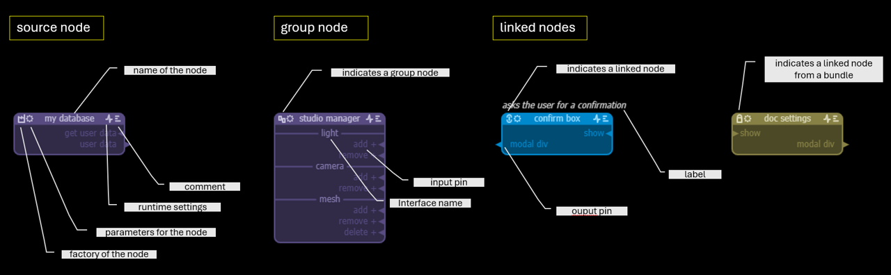

### Source Node

A *source node* can be recognized by the factory icon in the upper left corner. A source node has an implementation in software. Clicking on the *factory icon* shows the name of the factory and the path of the file where that factory can be found. The factory of node is a function that returns an instance of the node. It can also be a class name for example. More on how to instantiate nodes later.

The three other icons in the header of a node are shared by all types of nodes. 

- The *cog icon* represents the settings for that particular node. Depending on the type of node, you might want to pass some parameters to that node at the moment of instantiation of that node. Clicking on the cog icon opens a text window where you can add a *json* object to define the parameters for that node. The structure and content of the object are completely up to what the node requires.
- The *heartbeat icon* is where you can change the runtime behaviour of the node, for example if you want to run the node in a separate worker, or if you want some debug information for the node to be logged etc. The settings for the runtime behaviour are determined by what the runtime can do and are passed to the runtime at node-creation but not to the node itself.
- The *lines icon* is there to add comments for that node. The most common use of this field is to add a prompt to guide the LLM.

### Group Node
A *group node* is a node that is made from other nodes and can be recognized from the *group icon* in the upper left corner. When you click on that icon, a *view* opens to show the nodes that make up this node. Group nodes allow for a layered design. 

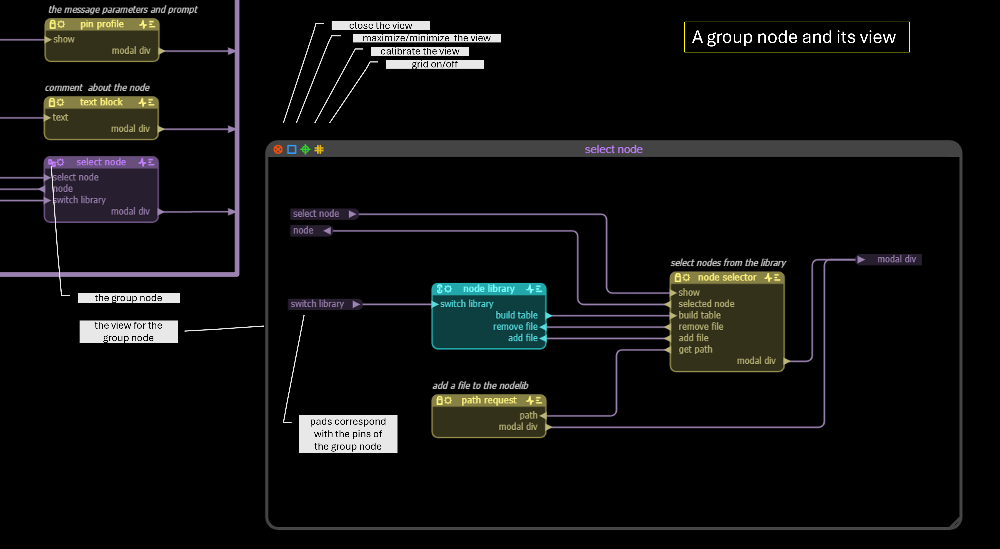

### Linked node

A *linked node* is a node that is imported from another file and can be recognised by the *link icon* in the upper left corner. When you click on the link, a popup shows the name and file where the actual node can be found. Linked nodes allow to re-use nodes from other projects or to spread a model over several files.

It is also possible to make a bundle from a model or from a list of nodes. In that case you can still link to the nodes in that model, but you have no access to the source code of these nodes. If the node linked to is from a bundle, the icon in the upper left corner is a *padlock icon*

You can change the name of a linked node, but not the inputs and the outputs, these have to be modified in the file where the node linked to resides.

### Elements of a node

#### 1. header
Each node has a header that contains the name of the node and the icons for that node. The name of a node has to be unique *in a view*.

#### 2a. pins: input and output
Nodes have pins for input and output, and are easily recognizable by their arrow. Pins can be at the left or the right of a node. Pins can easily be moved inside a node for example to allow connections to be made in a clear way. The name of an input pin has to be unique between the *input pins* of a node, and the name of an output pin has to be unique between the *output pins* of the node. The name of an input pin maps to the name of a handler - the function that will be called when a message is received on the pin. The name of an output pin is the name of the message that can be sent over this pin.

Sometimes it can be useful to group several messages into one input pin or output pin. An example for this would be the messages to add, remove or delete a mesh from scene manager. Instead of having to add three seperate pins for each node that needs to interface with with the scene list, we can simply add one pin for the three messages and put the variants between square brackets: '[add, remove, delete] mesh'. You can still use the '+' notation with such a multi-message (see below). Multi-messages save space and allow for simpler connections, but they are separate messages.

Note that pin names are *case insensitive*. This is done on purpose so that when writing the code for the node, you do not have to check on the case used for a message: *Get Rectangle Size* is considered the same as *get rectangle size*. When checking for the uniqueness of a name, the editor will disregard case.

Input pins for source nodes map to a *handler*, the method or function that will handle the messages delivered at this pin. The is a standard translation from pin name to handler name is as follows: white space and non-identifier characters are removed from the name and each seperate word from the name is then capitalised and concatenated, and finally the prefiw *on* is added to that to come to the name of the handler. Names of input pins will be considered not-unique if for two pins the derived handler name is the same.

Example: *some input message*, *SOME INPUT MESSAGE* and *%:/=Some InpUT MeS%%sage* all map to **onSomeInputMessage** as handler name. 

#### 2b. pins: request and reply

In most cases messages are delivered to a node and do not require a return, but sometimes a node will need to have some return on the action it requested. This can of course be handled by making an output pin over which the feedback can be given to the originating node, but this requires an extra pin and the extra routing. To simplify this particular case a new type of output/input pair was created: the *request* and the *reply*. 

Think of a request/reply pin as an output/input pin but with a back channel. When a request pin is connected to a reply pin then the reply pin can return a reply over the same connection. The node that issued the request can wait for the reply. Request / reply pins are recognisable by the small circle attached to the pin arrow.

You can connect a request to a normal input pin, for example to monitor activity on a pin. You can also connect a request pin to several reply pins and the request will then wait on all replies.

#### 3. interface name
Pins can be grouped in an *interface*. The name of the interface is shown between two line segments. All the pins below the interface name until the next interface or bottom of the node, are part of the interface. You can move an interface inside a node by dragging the interface name.

Names inside an interface can start or end with  **.** (period),  **-** (hyphen), **_** (underscore) or **+** (plus, but stands for space). In that case the name of the interface is added to the front or the end of the message name. This allows to use simple and clear pin names while still assuring the uniqueness of the names. 

Example: suppose the interface is named *document*, then the message names map as follows:
- *.write* is short for *document.write* and *write.* is short for *write.document*
- *-write* is short for *document-write* and *write-* is short for *write-dcoument*
- *_write* is short for *document_write* and *write_* is short for *write_dcoument*
- *+write* is short for *document write* and *write+* is short for *write dcoument*

Note that the full name of the pin is always used for generating the handler name or for checking connections via a bus.

#### 4. label
A lable is a short comment that is purely informative and dsiplayed above the node.

#### 5. color
The nodes of a file can be given a distinct color that sets them appart from the nodes that are imported from other files. The color will also be used as the color for the connections and busses in the file.

## Route

A route is a connection between an output pin and an input pin, or between a pin and a bus. Routes always follow an x,y grid to allow for a clean and clear layout. You can connect any output pin to any input pin, the names do not have to match. You can connect the same output pin to several input pins and a single input pin can be connected to many output pins.

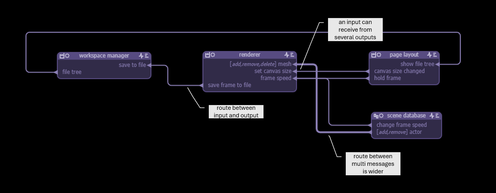

Connections between multi-messages are shown wider, because they combine several connections. You can connect to a multimessage if at least one of the variant parts of your message maps to a variant part of the pin you want to connect to. For example you can connect *document.[save, read, write]* to *file.[read, delete]*, but in that case only the message *document.read* will be received on the *file* pin, becasue it matches with *file.read*.

When you click on a pin the editor highlights the routes and pins that are connected to it.

Making a connection between two pins is simple : you left-click on the pin where you want he connection to start and move the mouse while keeping the left mouse button pressed.
While moving the mouse, the route will show as horizontal and vertical segments. The editor will switch from horizontal to vertical when you deviate a certain distance from the segment being drawn. You can also always backtrack if you are not happy with the route.

When you arrive at the pin that you want to connect to, that pin will change to the orange selection color and you can then release the mouse button and the connection will be established. If it is not possible to connect to the pin, for example if you want to connect an output to an output, the pin will change to red and you will not be able to connect these pins.

If you want to connect to a bus (see below), the bus will highlight when you move the cursor over it. If you release the mouse button then, the connection will be established.

To break a connection you left-click on a route while holding the *shift* button. The route will then be removed from the position of the mouse to the nearest pin of the connection. You can then continue to reroute that connection, or simply release the left mouse button to remove the route.

You can rearrange routes by simply left clicking on route segments and shift these up/down or left/right. When two horizontal segments are separated by a short vertical segment, the rounded corners of that small segment will change to sharp corners and if you release the mouse then the two horizontal segements will be joined. In that way you can simplify routes. The same goes for vertical segments of course.

## Bus

A model will often have to connect similar pins of nodes to several other nodes, for example if the nodes have an interface that they all implement. If you have to make all connections between individual nodes, the model quickly risks to become a tangled mess of routes, therefore a *bus* can be created to connect between the nodes.

There are two types of buses : a busbar and a cable. Buses only connect between other nodes: an output of a node connected to a bus will not send a message to an input of *the same node* that is also connected to that bus. Buses are designed for interfaces, and this choice prevents 'short circuits' that would otherwise have to be intercepted by the node. 

A busbar connects all the inputs that are connected to it, to all the outputs that are connected to it, regardless of the names of the pins. A busbar is the solution for *one-to-many* and *many-to-one* connections that often present themselves in real life designs.

A cable connects input pins to output pins *that have the same same*. They are the ideal solution if you have to connect interfaces between nodes.

Both a busbar and a cable can have a *filter*. A filter is a function that takes as its input the list of destinations for a particular message and produces from that a *filtered* list of destinations. The filter function and logic is typical for the application and supplied by the developer. So if a cable would deliver an output message to *n* nodes, the filter can then select from these node, the nodes that will actually receive the message based on some criteria.

Below you find a model that uses a busbar and cable bus. Buses can be given names for clarity.

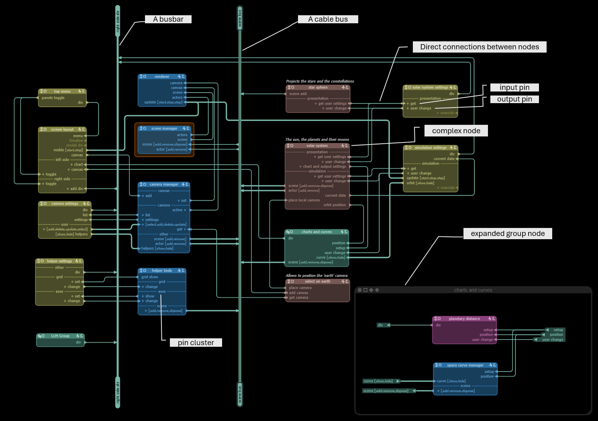

To draw a busbar you press *ctrl* and click the left mouse button. You can then draw the route for the busbar. If you want to draw a cable you press *ctrl shift* before left clicking. You can always convert a busbar to a cable and vice-versa (see below for the bus context menu)

## Pad

Group nodes are nodes that are a models themselves, they are made of connected nodes. The pins of a group node are represented inside the group node by pads.

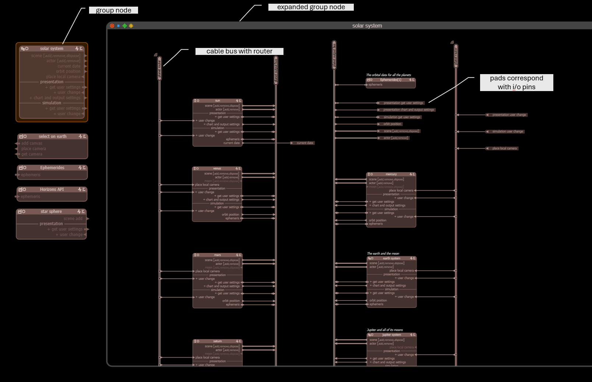

You can create a pad in two ways: either by simply adding a pin to the group node - the pad will then show up in the view of that group node - or by extruding a pin from a node inside the view for that group node. The extruded pin will then show up as a pin for the group node.

To extrude a pin you have to press *ctrl shift* and then left click on the pin. Moving the mouse will create the pad with a route to the pin attached to it.

# How to use the editor

Before diving into the details of working with the components of a **vmblu** design we will have a look at some general design principles of the vmblu editor.

## The canvas - panning and zooming

The canvas is the surface on which you create the model. Often your design will be bigger then the available screenspace, so if you click on the canvas you can move it to look at other parts of the model. You can also use the scroll-wheel to zoom in or out.

## Menu
The editor has a main menu of icons at the left hand side:

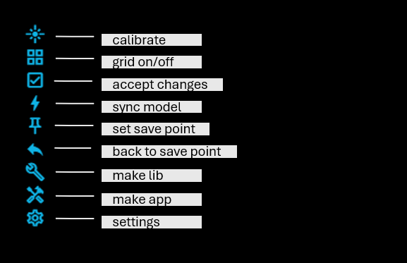

The menu options have the following meaning

### calibrate
This is a toggle that lets you jump between scale 1:1 and the zoomed view of you model. Useful if you are working on one part of the model and you quickly want to jump back to the normal view.
### grid on/off
Toggles a grid. Helpful when drawing routes or placing nodes.
### accept changes
When your model has linked nodes, ie nodes imported from other models or node libs, and these linked nodes have changed since the last edit of your model, then the changes will be highlighted: pins that have been added will be shown in green and pins that have been deleted will be shown in red. If you are fine with these changes, you can click this icon to accept them and the model will be adapted.
### sync model
When you are editing two or more files that import linked nodes between them, then when one file changes, other files that link to nodes in that file, will be updated automatically when you switch to these files. It is also possible to link to nodes that are in the same file, in that case you can click *sync model* to adapt all nodes linked to the node that you have modified.
### set save point
Before doing a large modification to a file, you can set a save point, ie a state of the file you can go back to if you want to undo all editing done afterwards.
### back to save point
Brings you back to the state of the file since you last set the save point. The default save point is when you started editing.
### make lib
A node library can be a normal **vmblu** model together with the source files that implement the funcionality of the nodes. However it is also possible to make a bundle that contains the model of the nodes and their source code in one file. The make lib command will generate a source file that can be used to make such a bundle.
### make app
When you are ready to run your model, you have to click on this icon to generate the soure file for your application.
### settings
The settings give some information about the model file and also let you change the base color for the model.
## Context Menus
The vmblu editor relies often on the use of context menus. You can get a relevant context menu by positioning on a node, a bus etc. and then clicking the left mouse button.

Below you find the context menu when you left click on the background of the canvas window. Remark that most of the selections also have an alternative keyboard combination.

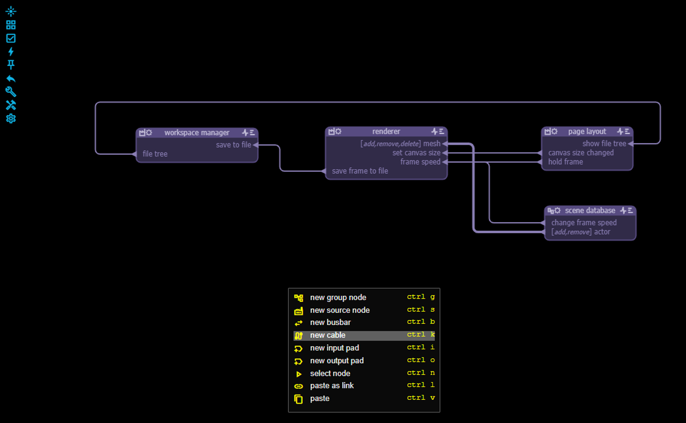

## Selections
You select something in the model by simply clicking on it. A selected node will have an orange rectangle around it and the selected pin is shown in orange. Below you see an example of a selected node and pin. Relevant keyboard commands will affect the selected node or pin.

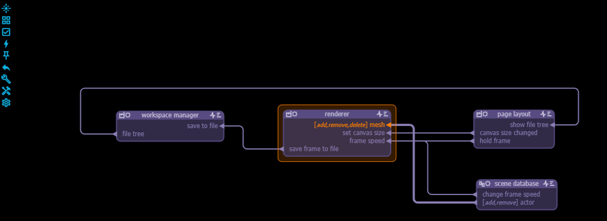

You can select multiple nodes by pressing 'shift' and moving the mouse. An orange selection rectangle is shown during the selection:

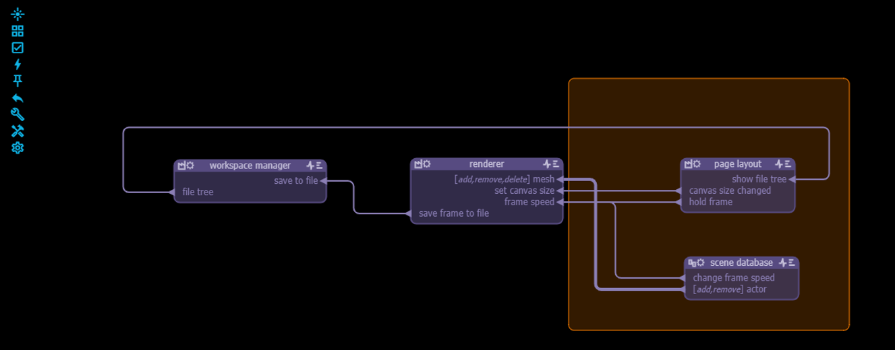

You can then left click the selection rectangle to move the selected nodes around, or right click to get the context menu for what you can do with the selection.

You can also select multiple pins inside a node by pressing *shift* and moving the mouse.

When you select a pin, the routes and the other pins that this pin is connected to will be highlighted. You can move a pin inside a node by pressing *ctrl* while moving  the mouse. The connections will follow the pin.

When you select a cluster name, pressing *ctrl* and moving the mouse, will move the entire cluster, ie the cluster name and the pins that belong to the cluster.

## Editing text fields
The vmblu models contain many text fields: pins, names, labels etc. You can edit these text fields by simply double clicking on them. You will then see a blinking cursor and you can move in the field by using the 'arrow' keys, the 'home' key or the 'end' key. Pressing the 'return' key or the 'esc' key, or simply clicking on another item in the model, will end the editing of the field.

## Undo and Redo

Most of the editor actions can be undone by pressing 'ctrl-z'. An action can be redone by pressing 'ctrl-shift-z'

# Empty canvas

When left clicking on an empty canvas the following context menu pops up:

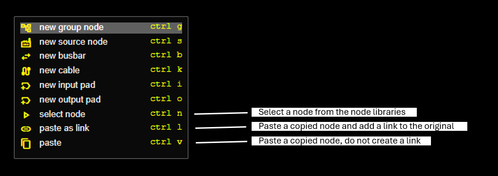

The first options of this menu are discussed in the respective chapters on nodes and busses. 

## Select node

The *select node* menu option pops up a list of library nodes that can be selected. Libraries are normal vmblu files that contain a list of nodes that you expect to need frequently in your project, so instead of going back and forth between the files, you can select them from a list of nodes.

You can add/remove library files to you project by selecting the option *libraries* in the settings menu for the vmblu file.

## Paste and Paste as link 

When you copy a node from a vmblu model there are two ways to copy the node in your model: with or without a link. If you paste as a link, the node will keep the link to the original node, so that when the original node is modified, the copied node will be changed as well. If you paste without the link, then everything from the original node is copied, but the nodes have become two independant nodes. 

# Creating a new node

Now we will look into more detail how nodes are created, modified or deleted. How to link to nodes in another file will be discussed later.

When you create a node you have to give it a name. The name can use all characters and have white space. The editor will signal when a name in a given view is not unique and show these names in red.

You can delete a node by simply selecting the node and pushing 'delete'.

If you left click on a node you can drag the node around.

There are two context menus for nodes: one when you right click on the header of the node, and one for when you right click on the pin-area of a node.

## Node header context menu

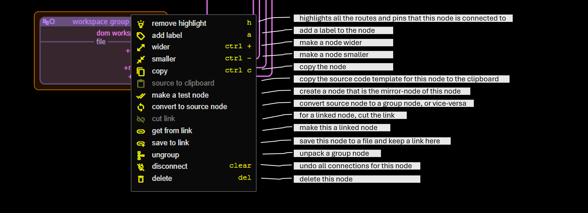

Below we look at the options of the context menu that need some additional explanation:

### source to clipboard

By clicking this option, a template for the source code of this node is copied to the clipboard. You can then paste this in the file where you want to store the source code for this node. An LLM does not need this initial scaffold, but if you want it for manual coding or clarity, you can generate it.

If we click this option for the node 'Renderer' above, this is the template that it creates:

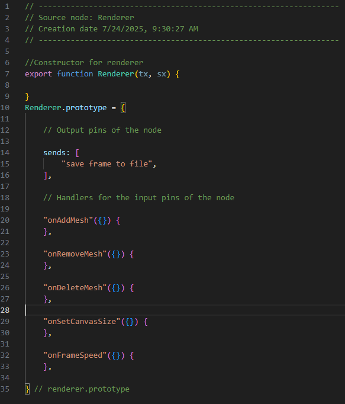

The output messages that you can send from this node are given as comments. The handlers for the node correspond to the input messages that the node can receive. The name for the handler is derived from the message by removing white space and other characters that are not allowed in javascript names, by starting ech new word with a capital and adding 'on' to the name: *set canvas size* becomes *onSetCanvasSize* for example.

Also note that the the multi-message input pin *[add,remove, delete]mesh* gives rise to three separate handlers.

The *factory function* that creates the object instance, *Renderer*, is passed two parameters at creation: tx and sx. The first parameter is an object that allows to send messages and the second object are the parameters required by that node at creation. We will discuss this in detail in the chapter about the code for a source node.

### make a test node

This option will create a node that is the mirror image of the selected node: each input is converted to an output and each output is converted to an input. The idea is then that this *mirror node* can be used as a node to test the original node by connecting inputs to outputs and vice-versa.

### convert to group/source node
If at a given moment you feel that a particular source node is becoming too complex and that you want to split the implementation in several nodes, you can select this option. The node itself will remain the same, same inputs and outputs, but will get a group icon and allow to make a separate model for the node. Conversely if you are working on a group node and you realize that you better bring all the functionality of the node into a single source node, you can do that to. 

### cut link - get from link - save to link
If a node comes from anothe file, you can cut the link if for example you want to keep the node's structure but want to rewrite the code for it. You can also make a node a linked node by setting a link for the node. Be aware that this will replace the node with the node linked to which might or might not be different with respect to the messages it sends and handles.

When working on a model you might be working on a node that you want to save to a separate file. The *save to link* option does just that: the node is saved to a separate file and the node in the current model is linked to that node.

### ungroup
Use this option if you want to unpack a group node and have all the nodes inside the group transferred to the model itself. Connections to the group node will be transferred to the nodes that were part of it.

## Pin area context menu

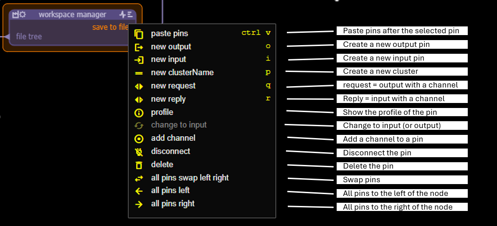

### new request - new reply

So far we have talked about input and output pins, but there is also a variation which has an added feature : a backchannel. Normally when you send a message you don't look back, you assume that somebody will take some action and if you need some return from it you will get a return message on some other pin.

In most cases this is fine, but it can also be that for a given message you expect a reply and that it might be much more clear in you code if the return is closely linked to the original message. That is where the request/reply come in. A request is an output message for which the receiving node can issue a reply, it is as if the route from the output to the input has a back-channel. This back channel is indicated by a adding a small circle to the input/output arrow of the pin:

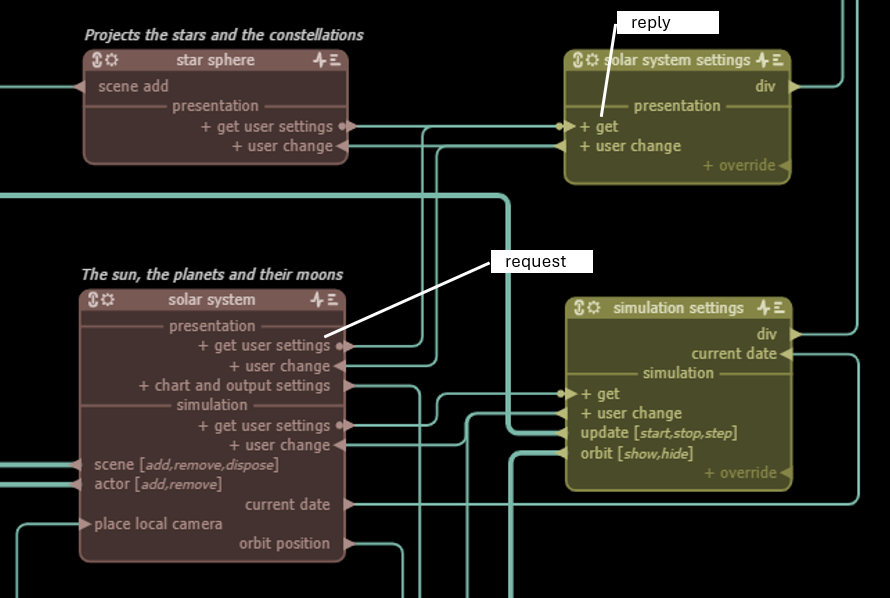

As we will see later, the functionality of the request/reply messages is implemented using *promises*. It is very well possible to get the same effect of a request/reply by using an extra message to return a result, but the request/reply is a more elegant solution in these cases. If however you are using a lot of request/reply messages between nodes, it is probably a sign that you should integrate these nodes in some way.

### profile

The profile of an input pin is the name of the handler and the parameters that the handler expects, ie the message content. The profile of an output message is the list of places in the source code where the message is sent from.

Vmblu is tightly integrated with the source code that implements the functionality of the nodes and the *profile* is the main access point from the model to the source code. **vmblu** uses ts-morph to make this information available. You can jump to the implementation of a handler for an input message from the profile, or to the location where a particular output message is sent. The information is localised by making use of JSdoc tags. If you add the tag *node name-of-the-node* in the file that has the code for the handlers for the input messages of the node, vmblu will be able to extract all relevant information from that file. See also teh chapter on the use of JSdoc tags.

### add/remove channel
If you want to convert an output or input pin to a request or reply respectively, you can do so by adding a channel. You can also remove the channel from a request/reply and convert them to an output or input pin respectively.

## Selecting multiple nodes

When you select a number of nodes and right-click on the selection, then the following context menu pops up: 


The non-trivial action in this context menu is *group*. This comand allows to transfer the selected nodes together into a new group node. The new group node will be connected where the previous nodes were connected and pads will be placed inside the group node for these pins.

After excuting *group* for the example above, the model will look as follows:


## Source node and source code

We will now have a closer look at the link between the source code for a node and the model of the node. 

When you left click on the factory icon of a source node, a popup as show below will appear:

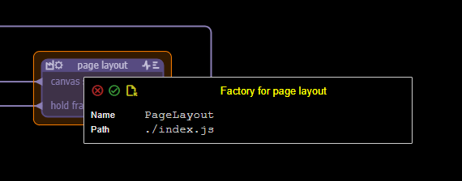

It will have derived a name for the object based on the name of the node, and it will also propose the source file name where the code for this node can be found. Both can be changed.

The path of the file is relative to the model file that is being edited, and as the index.js file is often used as the file where source file dependencies are grouped, it proposes this file, but you can change this to the file where the source code for the object actually resides.

Also the name of the factory can be changed. That name should either refer to a generator function or class, in which case it will be created by the runtime with *new*, or it can be a factory function which will simply be called by the runtime.

The runtime will call the factory with two parameters, tx and sx, short names for *transmitter* and *settings*. Settings is easy: it is the data that has been set for the node by clicking the *cog icon*. If nothing has been set then sx is null.

*tx* stands for *transmitter*, is an object provided by the runtime to the object. It's main purpose is to allow the node to send messages, but it also has a number of other functions.

### tx.send()

The format for sending a message is simple:

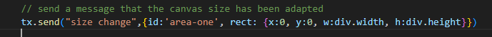

The first parameter is the name of an output pin of the node. If the node does not have a pin of this name, the message wil not be transmitted. The second parameter is the actual message payload. Most often this will be an object with the components of the message, but it can be a single parameter.

*tx.send()* returns the number of inputs it was actually delivered to. So if an output pin has three connections, it will return *3*. If a message cannot be send, either because the pin is not connected, or the message does not exist, tx.send returns 0.

### tx.pin

Most of the time *tx* is used inside a handler of a node. In that case you can get the name of the pin that *originated* the message as *tx.pin* : suppose that a node X transmits a message over its output pin *alpha* which is connected to input pin *beta* of node Y, then if you get *tx.pin* inside the handler *onBeta* it will return *alpha*.

### tx.request, tx.reply, tx.next

If an output pin has a channel you can use *tx.request()* as in this example:

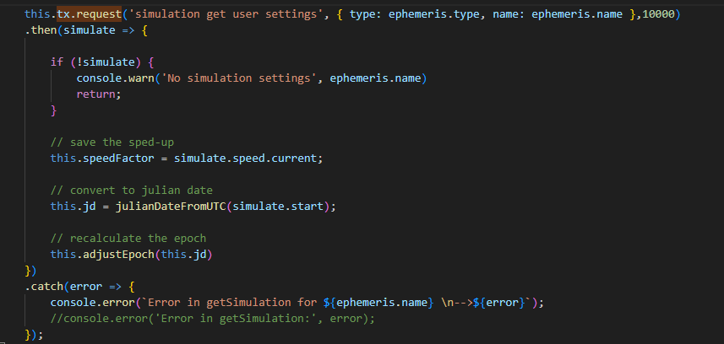

The parameters for the request message are also the name of the message and the actual message payload, but you can specify an optional timeout: if no reply is received within that period, the request will fail.

The node that receives the message can simply call *tx.reply(answer)* to return the answer to the requesting node. Because reply uses the back-channel, no message name has to be specified.

If a node needs to have a coneversation with the other node using the same backchannel, it can also use *tx.next(some parameters)*. The other node can then also use *tx.next()* to answer to this message. As soon as one of the nodes uses tx.reply(), the conversation over the backchannel is over. 

### tx.reschedule

*tx.reschedule* has no parameters and will just move the message on the message queue again, so that it will be presented to the node again the next time the message queue is handled.

The purpose of this function is to allow nodes to coordinate messages. Message delivery is not guaranteed to be in some predefined order. Depending on which node was created first, or the work it has to do, message order can change and you should not rely on some predefined order in your model. However in some circumstances it can be that you need to have received message A before you can handle message B. If you receive message B before message A, you can simply reschedule the message and wait until the next message round to handle the message when you will likely have handled message A in the meantime.

### tx.wireless

*tx.wireless* has one parameter: the name of the node you want to send a message to *without having a connection that node*.

The design idea behind **vmblu** is that it allows you to build a system from independant components and by connecting these components make a working application. The components themselves provide or request a service, without knowing who or how the results they produce are being used. In this way dependencies between the parts of a system are being made explicit.

For the majority of the nodes this is how you want to design them. There are however cases where it is desirable that a given node 'knows' the other components of the system. Let's take the example of an MCP Server. The MCP server gives the possibility for an LLM to use the system or parts of the system as a tool. **vmblu** can allow an LLM to communicate with each node. In **vmblu** the MCP server will be a implemented as a node and normally we would then connect this node to all other nodes that an LLM could request a service from. This can be a valid strategy if the number of connections is small, but if you want to allow the LLM to talk to all nodes, for example when executing tests for the complete system, this can become cumbersome, and that is where the *tx.wireless* function comes in.

*tx.wireless* takes one parameter, the name of the node you want to send a message to, and returns a specific transmitter for that node. You can use that transmitter then to *send* or *request* somthing from that node.

Below is an example of the typical use of *wireless*. 

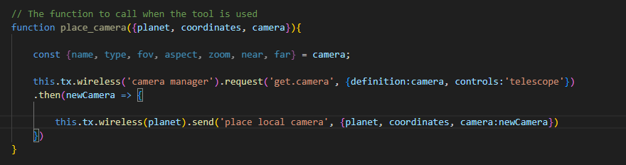

MCP servers and test nodes are typical examples of nodes where the *wireless* function comes in handy, but for normal nodes you will want to avoid the use of this function.

### What does a factory function return 

As already mentioned, a node is created by calling its factory function or by calling *new NodeName*. Very often a vmblu node will correspond to a class or an object returned by a generator function but is not limited to that. The only requirement for the factory function is that is returns an object that contains the handlers for the node. When the runtime creates a node by calling the factory function for that node, it will examine the object returned and identify the handler functions for the input pins of the node. It is perfectly possible to return just some object with the handlers. Examples of this can be found in the nodes based on svelte components for example.

# Making a bus

As already mentioned, buses come in three varieties: busbar, cable and router.

There are ways to create a busbar or a cable: via the background context menu or with the commands *ctrl b*, *ctrl k* respectively. To add a router to a bus you have to right click a cable and select *add router*.

A bus is made of a wire and a label at each end of the bus. You can route a bus by left clicking on the label and moving the mouse. You can move the segment of a bus by left clicking on the segment and moving it left to right or up and down. As with routes, when two segements are close together, the rounded corners become hard corners and releasing the mouse will then remove the short segment in between. This allows to simplify the route of the bus.

You can move the entire bus by clicking on the bus while holding the *ctrl* key.

## Bus tacks

When you want to connect a pin to a bus, draw a route starting from the pin and when you come with the cursor over the bus it will be highlighted. Releasing the mouse will make the connection to the bus and a small arrow, or bus tack, will be shown. You can move the last segment of the route up and down and the bus tack will glide over the segment of the bus it was attached to.

You can only connect a pin once to a bus: if the connection is not allowed the bus will be highlighted in red, and the connection 

When a node is moved a bustack does not move on the bus, so it can happen that when a node is moved a little bit that the route to a bustack will get a small extra segment without rounded corners. You can straighten that part of the route again by just clicking on the last segment. The bus tack will move a little then to make a straight last segment again.

## bus context menu

When right-clicking on a bus, the following context menu pops up:

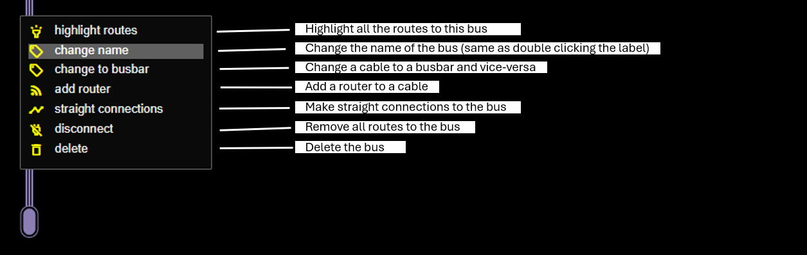

### Change to busbar - change to cable

You can always change a busbar to a cable and vice versa. Remember that the behaviour of these is very different: a busbar connects all the inputs connected to it to all the outputs connected, while a cable only connects inputs to outputs whose names match. 

Also remember that a bus connects between nodes, not inputs and outputs that belong to the same node.

### Adding a router to a cable

You can add router to a cable by specifying the source file where the router can be found and the name of the factory function for that router. The only requirement for the router is that it has a function *filter* which is called for each message that is sent over the bus. The *filter* function has three parameters: the list of nodes that would receive the message if the bus was a cable, the name of the pin of the nodes and the payload of the message. The filter function can then return zero, one or more of the node names, and these are then the nodes to which the message will actually be sent. Note that a router can only work with the nodes that are preselected by the cable, it cannot send to other nodes connected to the bus, let alone to other nodes not connected.

You can recognize a router from the small router symbol added to the label and from the small rectangles that are added where a bus tack connects to the bus.

Below you find a simple example from the *solar system* model, where the first parameter is used as the actual planet that should receive the message.


So a router provides the ease of connecting multiple similar nodes with a cable while still allowing for selective message delivery.

### Straight connections

Very often the connections to a bus will be single straight segments, after all that is why we have buses, to make connections simple. If in that case a node or the bus itself is moved, then normally extra segments will be created in the connections because of that. Instead of having to reposition all the connections to the bus in order to have the simple straight connections, you can click this option and then the editor will restore all the connections to straight connections where possible.

### Disconnect and Delete

You can disconnect all the nodes from a bus with a single command and also delete the bus with a single command.

# Linked nodes

As we have seen above, linked nodes are nodes that follow the layout of another node, for example a node in a separate file. The advantage of linked nodes is, that if the original changes by adding, removing or changing pins and cluster names, then the linked node will change as well.

When you click on the *link icon* of a linked node, then the name of the node linked to, toegether with the path to the file where the node is defined, pops up. Both can be changed to link to a different node. 

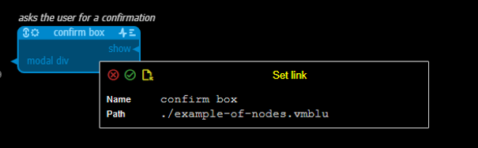

By clicking on the yellow file icon of that popup, the file of that node will be opened. You can jump directly to the file of the node by holding *ctrl* while left-clicking on the *link icon*

The name of a linked node can be changed, it will still be linked to the node in the link, but all other elements of the node cannot be changed: the names of the pins and the cluster are defined in the file where the linked node comes from and can only be changed there. When trying to change a linked node, the link icon will blink for a short while. However you can change the position of the pins and clusters of a linked node: this does not change the functionality of the node but can be helpful to improve the routing in the model where the linked node is used.

When a node is modified and a file with a node that links to it is also open or opened, then the modifications with respect to the previous situation will be made clear: added and modified elements will be shown in green and elements that have been removed will be shown in red. You can then inspect the changes and in the main menu click on *accept changes* if these changes are acceptable. If you do that all the connections to the pins that have been removed will be disconnected, so before accepting changes it might be necessary to reroute some of the connections.

A node linked to can also be in the same file so that, if you need a number of nodes in the model that share a common layout, you can make the first node the source node and simply link the other nodes to that node in the same file. Updates to the original node will be effective on the other nodes automatically. Models are updated automatically when you switch between files, so for changes to nodes that have links to them in the same file, you to use the *resync* menu option to propagate the changes.

# Navigating the source code from the model

**vmblu** allows you to create an architectural vizual model of your application. But equally important is that you can use the model to quickly navigate the source code that implements the functionality of the nodesin the model.

## jumping to other files

When clicking on the *link icon* of a linked node, a small popup will show you the link of the node: the name of the node linked to and the path of the file where the node can be found. You can then left-click on the file icon of the popup and that will open the vmblu file where that node is defined. Alternatively if you hold *ctrl* while clicking on the link icon, you will be immediately transferred to the file.

In a similar way a popup for a fatory function will be shown when you click on the factory-icon. You can also jump immediateley to the file while holding *ctrl* when clicking the factory icon.

## input pin profile

When you request the input profile of an input pin, a popup will show you the location where the handler for that input pin is defined - if there is a handler - and the parameter profile for that handler. If you are using typescript the type information is already present, if you are using plain javascript you can use jsdoc tags to specify the types. The following example shows the tags that can be used:

```js

    /**
     * @prompt Notification that a document has been renamed.
     * @node document manager
     * @param {Object} info
     * @param {string} info.oldName - Previous document name.
     * @param {string} info.newName - New document name.
     */
    onDocRenamed({oldName, newName}) {

        console.log('old-new', oldName, newName)
    },
```

There are three specific *tags* that you can use for vmblu: 
- *@prompt* explains what the handler does. Can be used as an input for an LLM to generate code.
- *@node* specifies the node that this handler is for. A node tag remains valid in a file untile a new node tag is encountered, so you typically have to set it only once in a file and not repeat it for every handler. If the node is not specified **vmblu** will try to infer the node name from the class name, but if a node is not defined as a class that will not be possible.
- *@mcp* when you use that tag, then vmblu will include this handler in the list of tools that can be used by an LLM to access the model

All other tags are standard jsdoc tags.

When the information about the handler for the input pin is shown, jou can jump to the handler by clicking on it.

## output pin profile

The output pin profile shows you were the message for this output pin is sent in the source of your application. By clicking on it you can jump to that location.

Note that for this to be possible you have to use the format *tx.send('message name',...)* of *this.tx.send('message name',...)* in your source code. If you make the message or the function opaque by assigning it to a variable this will not work.

## implementation

**vmblu** uses *ts-morph* to query the AST of the source code of a vmblu model. A separate utilty *vmblu-srcdoc.cjs* generates a documentation file when a model file is loaded. The name of the documentation file is derived from the model file *model-file.vmblu* as *model-file-doc.json*. When the source code is updated, *model-file-doc.json* is updated as well.

# Format of the application generated

When you are ready to test your application - and to do that it does not have to be complete - you can ask vmblu to generate the application source from the model. This will generate a javascript file that contains the following sections:

- an import section where all the node-factories are imported
- a list of the nodes to be created
- a list of the routers used in the app
- a call to the runtime to create all the nodes and start the message cycle

Below you find a some excerpts from the app file for the vmblu. 

## Import section
This section starts with the import of the runtime that will be used to scaffold and run the application, followed by the import of all the factory functions that are used in the application. 

```js
// ------------------------------------------------------------------
// Model: hv-layout
// Path: vmblu.js
// Creation date 6/2/2025, 11:29:56 AM
// ------------------------------------------------------------------

// import the runtime code
import * as RT from "../runtime/scaffold.js"

//Imports
import { WorkspaceFactory } from './workspace/index.js'
import { SingleTextFieldFactory,
		 ContextMenuFactory,
		 MessageBoxFactory,
		 TopMenuFactory,
		 TabRibbonFactory,
		 PathRequestFactory,
		 JsonInputFactory,
		 NameAndPathFactory,
		 PinProfileFactory,
		 TextBlockFactory,
		 MenuTabsWindow,
		 NodeSelectorFactory,
		 DocumentSettingsFactory,
		 ConfirmBox,
		 RuntimeSettingsFactory,
		 LeftMenuLayoutFactory,
		 SideMenuFactory } from '../ui/out/svelte-lib-bundle.js'
import { EditorFactory,
		 DocumentManager,
		 LibraryManager,
		 Clipboard } from '../core/index.js'
```

## Node list

The next section is the node list. Every node is identified by a four character unique uid. As we have seen node names need to be unique at the top level view and in each group node, but it is possible that nodes in the complete application have the same name, therefore each node is given this code.

For each node the list of input pins is given. These input pins need to map to the handler of the node that will be called when a message is received on this input pin.

Then the outputs are listed. The name of each output pin is followed by the input pins this output pin is connecetd to. The format of a connection is : *input pin @ node name (uid)*. If the output is connected to many pins then there will be a list of input pins.

Note that in this list of connections you will not find buses or pads: **vmblu** has resolved all indirect connections, via busses and pads, of the model into the real connections between source nodes and routers only.

```js

//The runtime nodes
const nodeList = [
	//___________________________________________________WORKSPACE
	{
	name: "workspace", 
	uid: "gtyk", 
	factory: WorkspaceFactory,
	inputs: [
		"-> dom add modal div",
		"-> file savedAs",
		"-> file active",
		"-> file closed"
		],
	outputs: [
		"dom workspace div -> left column @ left menu layout (Nkrj)",
		"file selected -> doc selected @ document manager (OLpG)",
		"file new -> doc new @ document manager (OLpG)",
		"file renamed -> doc renamed @ document manager (OLpG)",
		"file deleted -> doc deleted @ document manager (OLpG)",
		"file get name -> ()",
		"file context menu -> ()",
		"files selected -> ()",
		"files deleted -> ()",
		"files get list => ()",
		"directory renamed -> ()",
		"directory deleted -> ()",
		"directory context menu -> ()",
		"drawer get location -> ()"
		]
	},
	//___________________________________________SINGLE TEXT FIELD
	{
	name: "single text field", 
	uid: "pSXj", 
	factory: SingleTextFieldFactory,
	inputs: [
		"-> show"
		],
	outputs: [
		"modal div -> dom add modal div @ workspace (gtyk)"
		]
	},
	//________________________________________________CONTEXT MENU
	{
	name: "context menu", 
	uid: "IhMb", 
	factory: ContextMenuFactory,
	inputs: [
		"-> context menu"
		],
	outputs: [
		"modal div -> dom add modal div @ workspace (gtyk)"
		]
	},
```

If a node has settings, then these are listed here as *sx*. As we have seen these settings are passed to the node when the node is created by the runtime.

If there are specific settings for the runtime behaviour for this node, these are listed in the component *dx* of the node. These parameters are not passed to the node itself, but used by the runtime when the node is created. Example below.

```js

	//_____________________________________________SELECT ON EARTH
	{
	name: "select on earth", 
	uid: "qetT", 
	factory: SelectOnEarth,
	inputs: [],
	outputs: [
		"place camera -> place local camera @ planet router (DMTb)",
		"add canvas => left side canvas @ screen layout (BaQO)",
		"get camera => get camera @ camera manager (yNnY)"
		],
	sx:	{
		    "earth": {
		        "color": "0x007fff",
		        "textureFile": "/assets/2k_earth_specular_map.jpg"
		    },
		    "camera": {
		        "fov": 50,
		        "near": 0.001,
		        "far": 10
		    },
		    "planetCameras": [
		        {
		            "definition": {
		                "name": "earth camera",
		                "type": "perspective",
		                "near": 1e-9,
		                "far": 200,
		                "fov": 50,
		                "zoom": 1,
		                "aspect": "canvas"
		            },
		            "controls": "telescope",
		            "location": {
		                "planet": "Earth",
		                "coordinates": "50°53'10.7\"N 3°45'57.9\"E",
		                "inclination": 90
		            }
		        }
		    ]
		},
	dx:	{
			"logMessages": false,
			"worker": {
				"on": false,
				"path": ""
			}
		}
	},
```


## Filter list

If a bus has a filter then as we have seen the actual delivery of a message has to be determined at run time, for example based on a value in the parameters. A filter also has a uid and a router table. The filter table lists for each output connected to it, all the inputs it is possibly connected to. The filter can then select from these possible destinations the ones that will actually receive the message.

Example:

```js
//The filters
const filterList = [
	//________________________________________PLANET ROUTER FILTER
	{
	name: "planet router", 
	uid: "KAbB", 
	filter: PlanetRouter,
	table: [
		`place local camera : [
			"place local camera @ earth (hEXZ)",
			"place local camera @ mercury (YXpN)",
			"place local camera @ uranus (IKeo)",
			"place local camera @ neptune (pTDp)",
			"place local camera @ saturn (DWIr)",
			"place local camera @ mars (Dgou)",
			"place local camera @ venus (oeFm)" ]`,
		`presentation user change : [
			"presentation user change @ mercury (YXpN)",
			"presentation user change @ earth (hEXZ)",
			"presentation user change @ the moon (xTcR)",
			"presentation user change @ uranus (IKeo)",
			"presentation user change @ sun (fKqO)",
			"presentation user change @ venus (oeFm)",
			"presentation user change @ mars (Dgou)",
			"presentation user change @ saturn (DWIr)",
			"presentation user change @ neptune (pTDp)",
			"presentation user change @ Io (DdLG)",
			"presentation user change @ Europa (ooEx)",
			"presentation user change @ Ganymede (OxiF)",
			"presentation user change @ Callisto (aXQS)",
			"presentation user change @ jupiter (Wzci)" ]`,
		`simulation user change : [
			"simulation user change @ uranus (IKeo)",
			"simulation user change @ mercury (YXpN)",
			"simulation user change @ earth (hEXZ)",
			"simulation user change @ the moon (xTcR)",
			"simulation user change @ sun (fKqO)",
			"simulation user change @ venus (oeFm)",
			"simulation user change @ mars (Dgou)",
			"simulation user change @ saturn (DWIr)",
			"simulation user change @ neptune (pTDp)",
			"simulation user change @ Io (DdLG)",
			"simulation user change @ Europa (ooEx)",
			"simulation user change @ Ganymede (OxiF)",
			"simulation user change @ Callisto (aXQS)",
			"simulation user change @ jupiter (Wzci)" ]`,]
	},
]
```

## starting the runtime

You can install the standard runtime for vmblu applications as follows:

```bash
	npm install @vizualmodel/vmblu
```

If you want to use a different runtime for your application, you can specify that in the settings for the model. 

At the end of the app file the *scaffold* function from the runtime is called and all the nodes in the nodelist and all the routers in the router list are created.

The scaffold function returns the actual runtime for the application, and then the runtime is started.

```js
// prepare the runtime
const runtime = VMBLU.scaffold(nodeList, routerList)

// and start the app
runtime.start()
```

For each node in the node list, the scaffold function will first create the node. If the factory function cannot be called, an error will be thrown. If the factory function does not return an node, a warning will be shown on the console:

```js
console.warn(`** NO HANDLERS ** Node ${this.name} has input pins but no implementation.`);
```

Then for each input pin, the runtime will look for the handler function. Remember that for each pin *my input pin* a corresponding handler *onMyInputPin* must be found.

If no handler is found for a given input, then the following message is sent to the console:

```js
console.warn(`** NO HANDLER ** Node "${this.name}" has input pin "${rx.pin}" but no handler for it.`);
```
This will not prevent the application from running - it might be that at this stage the handler has just not been implemented yet.

Next for each output pin the destinations for that pin, will be put in a table for fast access when running the application.

When a node sends a message *tx.send('some output message', param)* and here is no corresponding output pin *some output message*, then a warning will be sent to the console:

```js
console.warn(`** NO OUTPUT PIN ** Node "${this.name}" pin: "${pin}"`, this.txTable)  
```
and the message will not be transmitted.

# The vmblu runtime

The **vmblu** runtime is small library to handle message queues. When there are messages on the queue, the runtime will go through each message and call the handler(s) that have to do something with the message. When the runtime arrives at the end of the queue and new messages have been added, the process restarts.

The runtime also keeps track of the *tx.request()* that have been made. And whenever a reply comes in or a timeout expires, the runtime will resolve/reject the outstanding promise.

The runtime can also deliver some services, such as outputting debug messages, running a node in a separate worker etc. 

All in all this make that the runtime is nimble, clocking in at around 50kB of code.

The source code of the runtime is also part of the **vmblu** repo.

# Working with AI in vmblu

AI can be used with **vmblu** at three levels:

- The model. The format of a **vmblu** model is a json file where the architectural elements and the graphical elements are well separatde, making it relatively easy for an LLM to understand and work with the format.
- The source code. You can use the tools you are using already to build the source code for the nodes
- The tools file.To interface with the application. When you generate the javascript file for an application, vmblu also generates a tools file *my-application-mcp.js* based on the handlers that have an *@mcp* tag. This tools file can be used as-is by the mcp server for the application. An example of the mcp tools file can be found below:

```js
// ------------------------------------------------------------------
// MCP tool file for model: 
// Creation date 6/27/2025, 4:40:26 PM
// ------------------------------------------------------------------

export const mcpTools = [
    {
        name: 'camera manager_camera update',
        description: 'Trigger camera update on camera manager',
        parameters: [
            {
                name: 'near',
                type: 'number',
                description: '- New near clipping plane distance.'
            },
            {
                name: 'far',
                type: 'number',
                description: '- New far clipping plane distance.'
            },
            {
                name: 'fov',
                type: 'number',
                description: '- New field of view angle.'
            },
            {
                name: 'zoom',
                type: 'number',
                description: '- New zoom factor.'
            },
            {
                name: 'aspect',
                type: 'number',
                description: '- New aspect ratio.'
            }
        ],
        returns: '',
        node: 'camera manager',
        pin: 'camera update',
        handler: 'onCameraUpdate',
        file: 'C:/dev/vm/app/solar/src/3d/camera-manager.js',
        line: 192
    },
    {
        name: 'camera manager_get camera',
        description: 'Trigger get camera on camera manager',
        parameters: [
            {
                name: 'definition',
                type: 'CameraDefinition',
                description: '- Definition of the camera.'
            },
            {
                name: 'location',
                type: '@param {import(three).Vector3} location.position - Position vector of the camera.\r\n\t * @param {import(three).Vector3} location.lookAt - LookAt vector of the camera.\r\n     * ',
                description: '- Location with position and lookAt vectors.'
            },
            {
                name: 'controls',
                type: 'ControlType',
                description: '- Controls type for the camera.'
            }
        ],
        returns: '',
        node: 'camera manager',
        pin: 'get camera',
        handler: 'onGetCamera',
        file: 'C:/dev/vm/app/solar/src/3d/camera-manager.js',
        line: 264
    }
]
```
